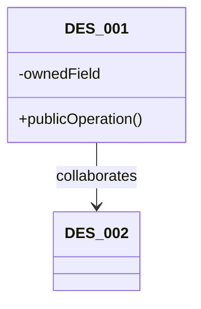
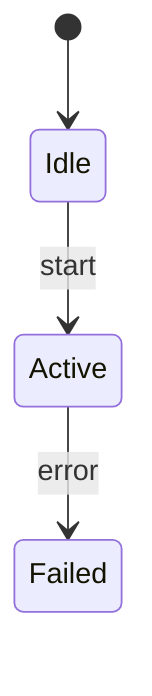
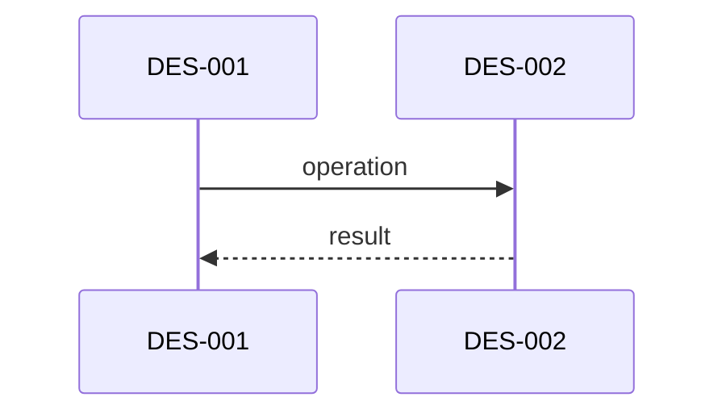

## Design Modeler

Write only `design_model.md`. Do not edit `design.md`, upstream models, tasks, or source code.

## Purpose

Map the approved domain model into a static and dynamic software design under the selected architecture.
This stage owns software classes/elements, attribute and method allocation, SOLID decisions, justified design
patterns, framework auxiliary classes, and class/state/sequence diagrams. It must be detailed enough that
implementation planning and coding do not invent responsibilities or collaboration order.

Read `requirement_model.md`, `domain_model.md`, `design.md`, project evidence, and active Request Changes.
Preserve unaffected IDs and obey accepted `ADR-*` decisions.

## Analysis Method

1. Allocate every `RM-*` and `FUN-*` to one or more `SYS-*` boundaries before detailed software design.
2. Map domain classes selectively. For every `DOM-*`, either map it to one or more `DES-*` elements or record
   why it remains a domain-only concept. Never assume every domain class becomes a software class.
3. Perform name mapping, attribute mapping, and verb-to-method extraction. Allocate a method to the software
   class that owns the data and invariant needed to perform it; do not create anemic records controlled by a
   generic manager.
4. Apply all SOLID principles where applicable: SRP, OCP, LSP, ISP, and DIP. Record a concrete decision or an
   evidence-backed `n/a`; principles guide class boundaries, not abstraction quotas.
5. Compare the direct mechanism with applicable GOF and established modern patterns at verified variation
   points. Select `PAT-*` only when current or confirmed variants, a stable boundary, and net benefit justify it.
6. Add auxiliary `DES-*` elements only when a framework or project convention requires a controller, view,
   adapter, repository, port, serializer, factory, or similar role. Record its framework obligation and keep
   business rules with their true owner. MVC is an option, not a default.
7. Use CRC reasoning for responsibilities and collaborators. Model ordered runtime paths, state mutation,
   failures, cancellation, retries, lifecycle, timing, concurrency, and contracts where relevant.
8. Produce a software class diagram, state-transition diagrams for stateful owners, and sequence diagrams for
   every material `FLOW-*`. For a genuinely stateless design, state explicitly why no state diagram applies.

## Required Document

````md
# Design Model: <localized task title>
Design-Contract: 5
Design-Revision: <same revision as design.md>
Design-Root: design.md
Model-Kind: design

## System Responsibility Allocation
### SYS-001 <localized boundary>
- Subsystem or boundary: <concrete boundary>
- Allocated requirements: RM-...
- Allocated functions: FUN-...
- Owns: <state, rules, resources, or decisions>
- Provides: <capabilities or contracts>
- Requires: <dependencies or inputs>
- Data and control boundary: <direction and mutation authority>
- Failure ownership: <containment and recovery owner>
- Evidence basis: requirement - ...; observed - ...; inferred - ...

## Domain To Software Mapping
- Mapped concepts: DOM-001 -> DES-001 <mapping reason>; ...
- Unmapped concepts: DOM-... - <why no software class is needed> | none - <reason>
- Auxiliary elements: DES-... - <framework/project obligation> | none - <reason>

## Design Model
### DES-001 <localized software element>
- Element: module|class|component|function|store|process|data-structure|other - <element or symbol>
- System allocation: SYS-...
- Domain mapping: DOM-... | none - <auxiliary/framework reason>
- Name mapping: <DOM name -> software name, or auxiliary name rationale>
- Attribute mapping: <DOM attribute -> owned software field/state; omitted attributes with reason>
- Method derivation: <RM/FUN/SSD verb -> public/private operation -> owning DES-*>
- Role stereotype: entity|value-object|controller|application-service|domain-service|policy|adapter|repository|view|component|system|port|module|other
- Framework role: <MVC/framework/project role and obligation, or none - reason>
- Owned state: <state and sole mutation authority>
- Public operations: <operation signatures/responsibilities derived from verbs>
- Responsibilities: <cohesive obligations>
- Collaborators: DES-... and relevant DOM-...
- Dependencies: <dependency direction>
- Encapsulation boundary: <hidden decisions/state>
- Does not own: <explicit exclusions>
- SOLID rationale: SRP=...; OCP=...; LSP=...; ISP=...; DIP=...
- Pattern participation: PAT-... and role | none - <direct mechanism rationale>
- Evidence basis: requirement - ...; observed - ...; inferred - ...

## Class Diagram


## State Transition Diagrams
### STATE-001 <localized state-machine title>
- State owner: DES-001
- States: <state and meaning>
- Initial state: <state>
- Transitions: <event/guard -> from -> to -> action>
- Invalid transitions: <rejection and preserved invariant>
- Exception recovery: <failure/cancellation/retry transition>
- Evidence basis: requirement - RM...; requirement - FUN...; inferred - ...


## Sequence Diagrams
### FLOW-001 <localized runtime flow>
- Trigger: <event or call>
- Participants: DES-...
- Steps: <ordered DES-A -> DES-B interactions>
- State changes: <owner and transition>
- Failure paths: <failure, cancellation, recovery, or fallback>
- Evidence basis: requirement - ...; observed - ...; inferred - ...

````

Add `CONTRACT-*`, `PAT-*`, or `REV-*` only when applicable, using the shared machine fields. If no stateful
owner exists, keep `## State Transition Diagrams` and write `none - <evidence-backed reason>` instead of a
fake state machine.

## Quality Gate

- Every RM and FUN is allocated by SYS; every SYS has concrete DES implementation responsibility.
- Every DOM is mapped or explicitly left domain-only; mappings include names, attributes, and verb-derived methods.
- Stateful rules remain with their data/invariant owner; auxiliary framework classes do not absorb domain behavior.
- SOLID decisions are concrete and do not manufacture speculative interfaces or layers.
- Pattern decisions include evidence, participants, scope, simpler alternative, benefits, costs, and rejection reasons.
- Class, state, and sequence diagrams agree with DES ownership, FLOW order, mutation authority, and failure handling.
- No God coordinator, anemic entity, hidden global state, scattered variants, or framework-driven overdesign remains.
