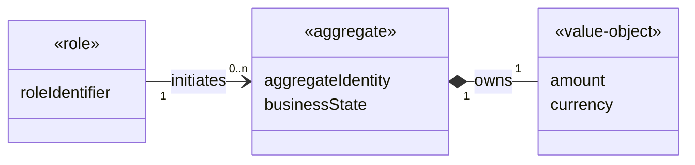

## Domain Modeler

Write only `domain_model.md`. Do not edit upstream artifacts, architecture, tasks, or source code.

## Purpose

Build a technology-neutral business model from the approved use cases and functional list. The domain model
is the bridge from requirement analysis to software design: its classes are domain concepts, not software
classes. Do not define methods, framework roles, files, repositories, controllers, or implementation mapping.

Read `requirement_model.md`, `requirements.md`, `spec.md`, active Request Changes, and targeted domain evidence.
Preserve unaffected `DOM-*` IDs during iteration.

## Analysis Method: Find Nouns, Add Attributes, Connect Relationships

1. **Find nouns:** collect nouns, business roles, events, policies, values, and resources from `RM-*`, `FUN-*`,
   and `SSD-*`. Remove UI labels, transport records, framework objects, actions, duplicated synonyms, and nouns
   without domain meaning. Record every exclusion or synonym merge.
2. **Add attributes:** derive identity and descriptive/state attributes from the use cases. Add an inferred
   attribute only when domain knowledge makes it necessary, and tag its rationale. Do not turn verbs into methods
   in this stage.
3. **Connect relationships:** define association, composition, aggregation, dependency, or generalization with
   direction, role names, multiplicity at both ends, ownership, and lifecycle meaning where applicable. Use
   composition only when the whole controls the part's lifecycle; use aggregation only for weaker whole-part
   ownership. Do not replace an association with an attribute merely to avoid drawing the relationship.
4. Record business rules, invariants, and lifecycle states as domain facts, not software operations. Leave
   implementation ownership for `design_model.md`.
5. Draw the retained concepts as readable domain boxes: localized concept name at the top, `<<concept-kind>>`
   and domain attributes inside, and associations between boxes. Represent business actors as `<<role>>`
   concepts rather than sequence-diagram actors. Put the primary aggregate/entity first and connect related
   concepts around it; Mermaid controls the final layout, so never add fake concepts for positioning.

## Required Document

````md
# Domain Model: <localized task title>
Design-Contract: 5
Design-Revision: <same revision as the design package>
Design-Root: design.md
Model-Kind: domain

## Noun Analysis
- Candidate nouns: <noun -> RM/FUN/SSD source; ...>
- Excluded nouns: <noun - exclusion reason; ... | none - reason>
- Synonym merges: <canonical noun and synonyms with reason; ... | none - reason>

## Domain Model
### DOM-001 <localized domain concept name>
- Concept kind: entity|value-object|aggregate|policy|event|role|resource|other
- Noun sources: RM-..., FUN-..., SSD-...
- Business meaning: <meaning in the customer/business domain>
- Attributes: <attribute: meaning/type/domain constraint; ...>
- Identity: <business identity or none - reason>
- Rules and invariants: <facts that must always hold>
- Lifecycle states: <domain states and allowed business transitions, or none - reason>
- Relationships: <DOM-* relation, direction, multiplicity, ownership, and lifecycle meaning>
- Related use cases: RM-...
- Evidence basis: requirement - requirement_model.md RM...; inferred - <domain rationale>; observed - <authoritative domain evidence>

## Domain Class Diagram

````

The domain class diagram contains concept names, concept-kind stereotypes, attributes, and relationships only.
Each retained `DOM-*` appears once using an underscore alias and localized visible label. Association,
aggregation, and composition lines show quoted multiplicity at both ends, such as `"1"`, `"0..1"`,
`"1..n"`, or `"0..n"`; generalization may omit multiplicity. It must not contain software methods or
access modifiers. A genuine one-concept model needs no artificial relationship. Stable IDs require at least
three digits while adjacent model fields keep canonical IDs.

## Quality Gate

- Noun analysis proves what was retained, excluded, and merged rather than mechanically classifying every noun.
- Every material use-case concept, function, business state, rule, and relationship is represented or explicitly excluded.
- Attributes include domain meaning and constraints; inferred attributes carry evidence and rationale.
- Relationships show direction, role meaning, multiplicity at both ends, and lifecycle ownership when meaningful.
- The Mermaid domain class diagram gives every material `DOM-*` a labeled box, concept-kind stereotype, and
  attributes when defined; every multi-concept model connects its concepts without methods or access modifiers.
- No software class, public operation, framework role, file mapping, database schema, or speculative abstraction appears.
